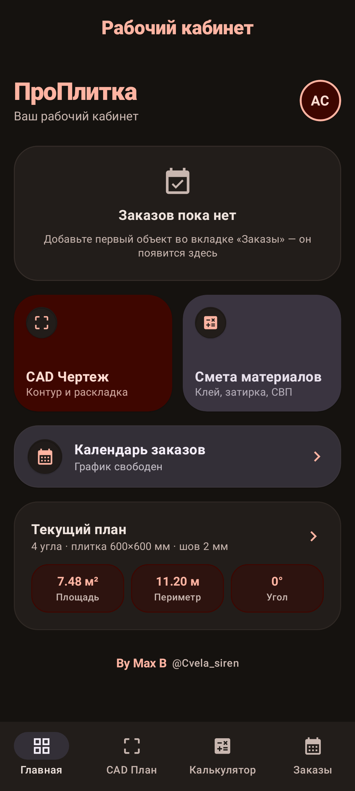
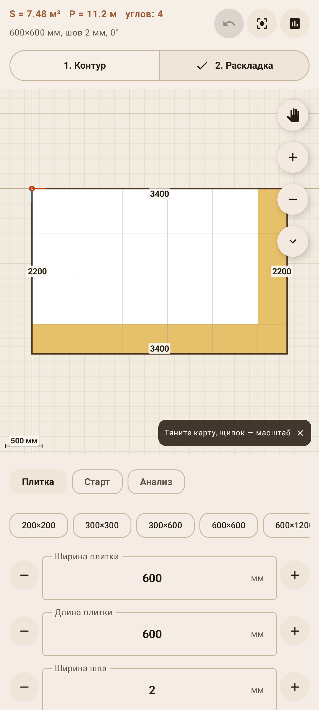
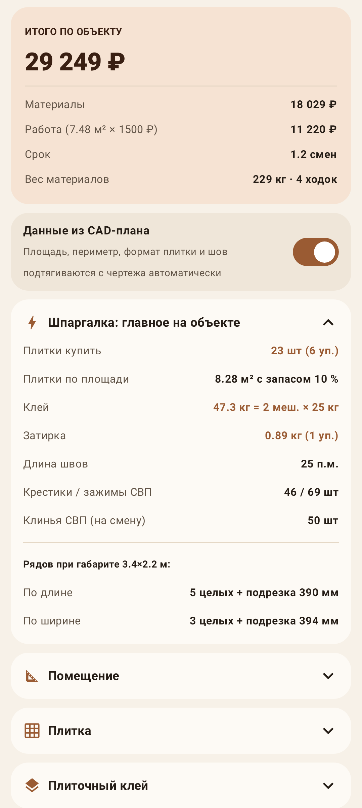

# ПроПлитка

**Инструмент плиточника: точный план помещения, раскладка плитки и смета материалов — прямо на объекте, без интернета.**

Замерил помещение → построил план с точностью до миллиметра → разложил плитку под нужным углом → получил количество плитки, мешков клея, килограммов затирки и стоимость работ. Одним приложением, за пару минут, стоя в пустом санузле без компьютера под рукой.

| Главная | Чертёж и раскладка | Смета |
|---|---|---|
|  |  |  |

---

## Зачем это

Обычный расклад на объекте: рулетка, блокнот, калькулятор в телефоне и «на глаз плюс десять процентов». Потом выясняется, что плитки не хватило на две штуки, клея взяли на два мешка больше, а подрезка у дальней стены вышла в два сантиметра и смотрится халтурой.

ПроПлитка закрывает всё это одним инструментом:

- **план помещения любой формы** — не только прямоугольник, а Г-образный санузел с венткоробом и нишей;
- **честная раскладка** — видно, где будет подрезка и какой ширины, ещё до покупки плитки;
- **расчёты по реальным нормам**, а не «примерно» — с таблицей расхода клея по зубу гребёнки и формулой затирки;
- **смета клиенту** — отправляется в мессенджер одной кнопкой.

---

## Что умеет

### 1. CAD-план помещения

Редактор геометрии, рассчитанный на замер по месту.

- **Ввод в миллиметрах.** Любое число вводится руками; пресеты есть, но они — только быстрый ввод, а не единственный вариант.
- **Стрелки с выбираемым шагом.** 1 / 5 / 10 / 25 / 50 / 100 / 500 мм или своё значение. Угол двигается крестовиной, значение добирается кнопками «−» и «+».
- **Длина стены задаётся числом.** Можно выбрать, что при этом двигать: конец стены, начало или оба конца симметрично.
- **Замок длины.** Стена с замком держит свой размер: при перемещении соседних углов решатель связей возвращает ей заданную длину. Так воспроизводится реальная геометрия, где одна стена точно 3420, а остальные «как получилось».
- **Закрепление угла.** Закреплённый угол не двигается вообще — от него и пляшет остальной контур.
- **Полярный ввод.** «От этого угла 1250 мм под 118°» — ровно так, как снимается непрямой угол.
- **Азимут стены числом**, шаг угла от 0,1°. Есть выравнивание по 90° и выпрямление всего контура.
- **Короба, колонны, ниши** — прямоугольники с любым поворотом, вычитаются из площади и учитываются в подрезке.
- **Подписи прямо на чертеже:** длина каждой стены, внутренние углы, масштабная линейка. Отмена — 40 шагов назад.

### 2. Раскладка плитки

- **Размер плитки и шов — свои.** 1200×2780 мм слэб или мозаика 48×48 — без разницы.
- **Любой угол раскладки**, задаётся числом с выбранным шагом. Быстрые кнопки 0 / 15 / 22,5 / 30 / 45 / 60 / 90°.
- **Схемы:** прямая, разбежка с настраиваемым процентом смещения, ёлочка, диагональ.
- **Точка старта:**
  - *от угла* — выбираете конкретный угол помещения и отступ по X и Y;
  - *от точки* — тап по плану и доводка стрелками с тем же шагом;
  - *от центра* — со смещением, если нужно.
- **Анализ подрезки.** Считается, сколько плиток ложится целиком, сколько идёт в подрезку, и какая подрезка получается у стен. Если она уже трети плитки — приложение об этом скажет: такую раскладку лучше сдвинуть.

### 3. Смета материалов

Все коэффициенты настраиваются — цифры у поставщиков разные.

| Раздел | Что считает |
|---|---|
| Плитка | штуки, упаковки, м² с запасом (5–20 % по схеме укладки), вес, стоимость |
| Клей | расход по зубу гребёнки (таблица 4–20 мм), поправка на перепад основания, двойное нанесение, мешки |
| Затирка | по формуле `(A+B)·C·D·ρ/(A·B)`, цементная или эпоксидная, погонаж швов |
| Основание | грунтовка, обмазочная гидроизоляция + гидролента, стяжка и наливной пол |
| Расходники | крестики, зажимы СВП, клинья (клинья — только на дневную выработку, они многоразовые) |
| Погонаж | плинтус, профиль, уголок за вычетом проёмов |
| Работа | стоимость за м², срок в сменах |
| Логистика | общий вес материалов и сколько ходок на этаж |

**Данные из плана попадают в смету сами.** Площадь, периметр, формат плитки и ширина шва берутся с чертежа и пересчитываются на лету — переносить руками ничего не надо. Тронули любое из этих полей — связь разрывается, и калькулятор переходит на ручной ввод; вернуть её можно тумблером.

Наверху карточки — **шпаргалка**: сколько плитки купить, сколько мешков клея, сколько рядов ляжет и какая останется подрезка. Это то, что нужно знать у прилавка.

### 4. Заказы

Календарь объектов: клиент, адрес, дата, сумма, статус. На главной висит ближайший активный заказ — без выдуманных процентов готовности, только то, что реально записано.

---

## Как этим пользоваться на объекте

1. **Замерьте помещение.** На вкладке «CAD План» → «Форма» → «Задать прямоугольник по размерам» введите габарит. Для сложной формы добавляйте углы: «Стены» → «Разделить», потом двигайте новый угол стрелками.
2. **Уточните стены.** Тапните стену, введите её точную длину. Стену, которую вы уже замерили точно, закройте на **замок** — дальше она не поедет.
3. **Добавьте короба.** Вкладка «Короба» → «+ короб», введите габарит и положение.
4. **Задайте плитку.** Вкладка «Раскладка» → «Плитка»: формат, шов, схема, угол.
5. **Поставьте старт.** «Старт» → «От угла» и выберите, от какого угла начинаете класть. Смотрите на подрезку у противоположной стены и двигайте старт стрелками, пока она не станет приличной.
6. **Проверьте подрезку.** «Анализ»: целых плиток, в подрезку, минимальная подрезка у стен.
7. **Откройте смету.** Вкладка «Калькулятор» — площадь и формат уже там. Проставьте свои цены, выберите зуб гребёнки (или оставьте автоподбор).
8. **Сохраните расчёт.** Кнопка «Сохранить расчёт» кладёт в историю и цифры, и весь ввод. Позже открываете запись → «Открыть» — план и все цены возвращаются на место. Кнопка «Отправить» отдаёт смету текстом в любой мессенджер.

**Введённое не теряется.** Переключение вкладок, сворачивание приложения, перезапуск телефона — план и цены остаются на месте. Приложение сохраняет рабочее состояние само, каждый раз, когда вы из него выходите.

---

## Откуда взяты цифры

Значения по умолчанию — не выдуманные. Таблица расхода клея по зубу гребёнки, формула затирки и запасы на подрезку сверены с профильными источниками:

- [расход плиточного клея и затирки: таблицы и формулы](https://emwoody.ru/blog/raskhod-plitochnogo-kleya-i-zatirki/)
- [калькулятор плиточного клея LITOKOL](https://www.litokol.ru/tech/kalkulyator-plitochnogo-kleya/)
- [расчёт клея Ceresit](https://ceresit.ru/ru/systems/raschet-kleya-dlya-plitki/)
- [расход по зубу шпателя, Vetonit](https://vetonit.com/blog/articles/kak-pravilno-rasschitat-kolichestvo-plitochnogo-kleya-na-kvadratnyy-metr-plitki/)
- [расчёт элементов СВП, ВсеИнструменты](https://www.vseinstrumenti.ru/publication/kak-rasschitat-elementy-svp-dlya-plitki-kolichestvo-rashodnyh-materialov-na-kvadratnyj-metr-2594/)

Формулы проверены тестами против справочных таблиц: например, расход затирки для плитки 200×200×8 со швом 2 мм даёт 0,32 кг/м² — ровно как в справочнике.

**Важно:** приложение считает материал, а не гарантирует результат. Запас на подрезку, кривизну основания и бой остаётся зоной ответственности мастера — поэтому все коэффициенты открыты для правки.

---

## Данные и приватность

- Всё хранится **только на устройстве**, в локальной базе.
- **Ни одного разрешения** в манифесте и **ни одного сетевого запроса** в коде. Приложение полностью работает в самолётном режиме.
- Аккаунт не нужен, регистрации нет, аналитики нет.
- Смета уходит наружу единственным способом — когда вы сами нажали «Отправить» и выбрали, куда.

---

## Установка

Скачайте `MasterPlitki-release.apk` и откройте на телефоне. Android 7.0 и новее.

При первой установке система один раз спросит разрешение «Установка неизвестных приложений» для того приложения, из которого вы открыли файл (проводник, мессенджер, браузер) — это нормально для APK не из магазина.

---

## Сборка из исходников

Стек: Kotlin, Jetpack Compose (Material 3), Room. Сборка — Gradle, без Android Studio; подробности и пути к тулчейну в [BUILD.md](BUILD.md).

```bash
./build-apk.ps1 :app:assembleRelease
```

Тесты:

```bash
./build-apk.ps1 :app:testDebugUnitTest
```

50 тестов покрывают то, что дороже всего сломать:

- `CadGeometryTest` — площадь, углы, азимуты, решатель зафиксированных длин, генерация раскладки и подсчёт подрезки;
- `TileMathTest` — расходы материалов, сверка с табличными значениями;
- `SnapshotPersistenceTest`, `StorageTest` — введённое переживает перезапуск, сохранённый расчёт открывается обратно;
- `ScreenSmokeTest` — экраны собираются, состояние не сбрасывается, данные плана доезжают до сметы;
- `ScreenshotTest` — снимки экранов, чтобы поймать регресс вёрстки глазами.

### Структура

```
app/src/main/java/com/example/
  data/            Room-сущности, репозиторий, снимки состояния (JSON)
  ui/cad/          геометрия помещения, решатель связей, движок раскладки, отрисовка чертежа
  ui/calc/         формулы расхода материалов и состояние калькулятора
  ui/screens/      экраны: главная, CAD-план, калькулятор, заказы
  ui/theme/        палитра и типографика
```

Расчётное ядро (`ui/cad/CadGeometry.kt`, `ui/calc/TileMath.kt`) — чистые функции без Android-зависимостей: их легко тестировать и можно перенести на другую платформу.

---

## Ограничения и что дальше

Честно о том, чего пока нет:

- нет экспорта чертежа в PDF или картинку;
- ёлочка строится корректно для любых пропорций, но раскладка «модульная» (несколько форматов в одном узоре) не поддерживается;
- расчёт ведётся по одной поверхности за раз — пол и стены считаются отдельными заходами;
- сметы не привязываются к заказам;
- нет облачной синхронизации между устройствами (и это осознанно: приложение должно работать в подвале без связи).

---

## Автор

**By Max B** — [@Cvela_siren](https://t.me/Cvela_siren)
